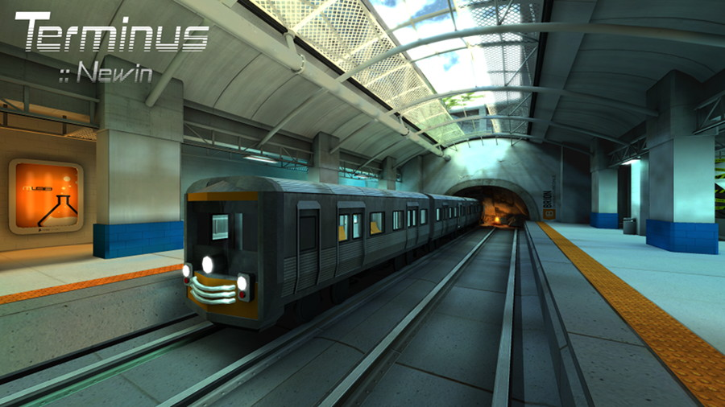

Terminus
--------

This is a metro-themed map designed by Honoré “newin” Jaussoin for the [Urban Terror](http://www.urbanterror.info) game. This project is a port to the [Unvanquished](https://unvanquished.net) game. It features an imaginary collapsed underground station in Bordeaux, France.

This map was already ported to Tremulous in the past, but it was'nt made cleanly: the porter had decompiled and recompiled it, and many issues were introduced. Since newin does not have his sources anymore, and to avoid an unreliable decompilation process, this port is done using the [Granger's gardening toolbox](https://github.com/illwieckz/grtoolbox) which provides a tool to edit BSP files.

This map was named _“Metro”_ on Urban Terror, it is named _“Terminus”_ on Unvanquished to avoid conflicts with an homonym map by KOsAD.

Levelshot
---------




How to
------

* Get the sources

```
git clone https://github.com/InterstellarOasis/map-terminus_src.dpkdir.git
cd map-terminus_src.dpkdir/
```

* Build

You need the [Urcheon](https://github.com/illwieckz/Urcheon) tool and [q3map2_helper.sh](https://github.com/illwieckz/q3map2_helper) (there is some work in progress in q3map2 to avoid the need of `q3map2_helper.sh`).

You will find the dpkdir in `build/test`.

```
urcheon build
```

* Package

You will find the dpk in `build/pkg`.

```
urcheon package
```

Run the map:

```
daemon -pakpath build/pkg +devmap terminus
```

History
-------

* 2012-01-29:	Metro beta 2
* 2011-12-31:	Metro beta 1

Credits
-------

Unvanquished port:

* Thomas “illwieckz” Debesse <dev@illwieckz.net> (http://gg.illwieckz.net)

Mapping:

* Honoré “newin” Jaussoin <big.newin@gmail.com> (http://newincore.tumblr.com/)

Extra credits
-------------

This map uses some models by Black Rayne Studios <blackraynestudios@gmail.com>.
